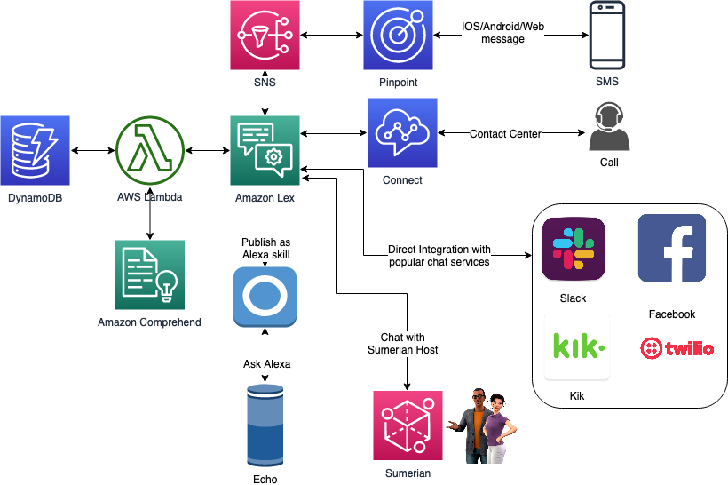

# Amazon Lex HR Portal
Build Amazon Lex chatbot to interact with Lambda, Amazon DynamoDB, Amazon Pinpoint, Amazon Comprehend, Amazon Connect, Twilio, Slack, Facebook, Kik and Alexa devices

## Architecture

## Motivation to build this bot
Bot is built for those employees who does not have or does not like navigating to complicated HR website to communicate for doing basic daily tasks, and would rather do it using SMS, Call, Alexa devices as regular dialog coversation like you are asking your assitant or friend to do the task for you.

The task this bot can do are:

1. Logging daily work hours.
2. Calculate total pay for the month.
3. FAQ search like polcies, agent, salary etc
4. Most importantly, all the interactions are beging analyzed by Amazon Comprehend for sentiment analysis. This way if the user is not happy we can divert the interation immidiatly to human.

Future enhancement and implementation:
1. Integration with AR VR Amazon sumerian https://docs.sumerian.amazonaws.com/tutorials/create/beginner/dialogue-component/
2. More HR functionalities like vacations calander, leave balance etc

## Cost of this serverless setup for a month use even for production scale $2 - $10
Lex       :   $0.38 (500 text requests)
Pinpoint  : 	$0.06 (first 100 SMS FREE then $0.00645 per request)
Lambda    :   $0.20 (PER 1M REQUESTS, First 1M requests per month are free)
DynamoDB  :   $1.50 (First 25 GB per month is free + $1.25/million write + $0.25/million read)
Comprehend:   $0.0001 (Upto 10M units)
Connect   :   $0.06 (For inbound calls in USA)
SNS       :   $0.50 (Per 1 million Amazon SNS, first 1 million is free)

# Use cases
## Greet the user with welcome message and HR menu options - Lambda Fulfilment

## User authentication and validation against identity database (DynamoDB in our case) - Lambda Validation

## Log in working hours, validate date and working hours

## Calculate pay in a particular month

## Search common FAQs related to HR services, like Policy, Salary, Agent

## Sentiment Analysis of user interaction and connect to human support of negative sentiment found
